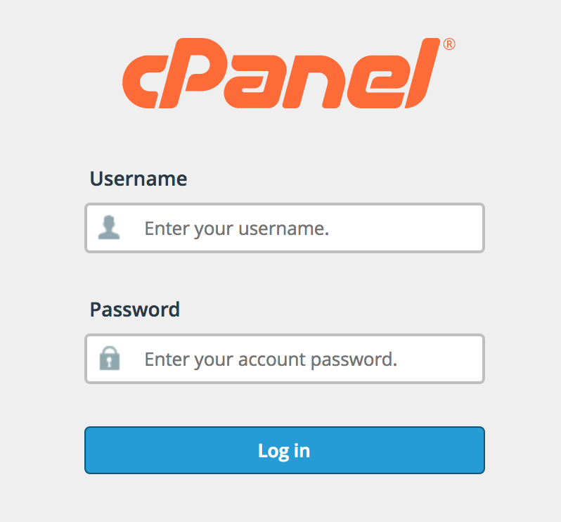
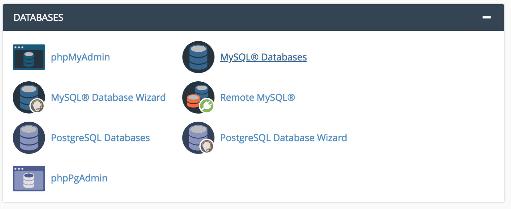

# Air-Quality-Station-Setup
All you need in Setting up your own Air Quality Monitoring Station

<h1 style="font-size:140%;margin-left:0.8em;"><b style="color:#444;">Air Quality Station Tutorial</b></h1>

 
</section>

<section style="background-color:#e8f3fc;">

 

<h1> 1_ Step One :  Create MySql Database</h1> 

<b>Here we will discuss the steps to creating a Database (MySQL) that will be used to both store and display the data collected
from the air quality monitoring unit. You can follow this video (<a href="https://www.youtube.com/watch?v=0tdFBqDsOqQ" target="_new">https://www.youtube.com/watch?v=0tdFBqDsOqQ</a>) till 5:20 for a visual perspective of this procedure.</b>
  
<b>1</b>) Login into your web hosting provider's control panel. ie. Most use "CPanel". To access your CPanel account, go directly to 
<b>http://YourDomainName.com/cpanel</b>.    
<b>2</b>) Look for the Tab that says "Databases". Once found, click on "<b>MySQL® Databases</b>"  
  
<b>3</b>) Here we need to do three (<b>3</b>) things. <b>Firstly</b>, you should go ahead and create a database name of your choice then click "Create Database". 
 
<b>Secondly</b>, you need to create a MySQL user account. Scroll down the same page and look for the area that says "MySQL Users". Insert a Username and Password combination of your choice then click "Create User".
<b>Lastly</b>, scroll on that same MySQL page for where it says "Add User to Database". Under the user drop down menu bar, select the MySQL user account you just created and under the database drop down menu, select 
the database name you created for your unit. Next click "Add". On the "<b>Manage User Privileges</b>" page, ensure to select the "<B>ALL PRIVILEGES</b>" radio button, then click "<b>Make Changes</b>". 
  
<b>4</b>) Go back to your CPanel main page (http://YourDomainName.com/cpanel). Locate the "Databases" tab then click on "phpMyAdmin". On the newly opened page, click on the database you recently created 
situated to the left of the window. Next, click on "SQL" on the top-right portion of that page as seen in the image below. 
 
In the "<b>Run SQL query/queries..</b>" field, copy and paste script below." then click "Go".  

CREATE TABLE IF NOT EXISTS `airquality` ( 
  `airquality_id` int(100) NOT NULL AUTO_INCREMENT, 
  `unit_id` int(10) NOT NULL, 
  `pm_1` varchar(100) NOT NULL DEFAULT '', 
  `pm_2_5` varchar(100) NOT NULL DEFAULT '', 
  `pm_10` varchar(100) NOT NULL DEFAULT '', 
  `celcius` varchar(100) NOT NULL DEFAULT '', 
  `fahrenheit` varchar(100) NOT NULL DEFAULT '', 
  `humidity` varchar(100) NOT NULL DEFAULT '', 
   i_p varchar(60) NOT NULL, 
   mtimestamp varchar(60) NOT NULL, 
  `date_received` varchar(50) NOT NULL, 
  `thedate` varchar(50) NOT NULL, 
  `thetime` varchar(50) NOT NULL, 
  PRIMARY KEY (`airquality_id`), 
  UNIQUE KEY `id` (`airquality_id`), 
  KEY `id_2` (`airquality_id`) 
);  

 
<h1> 2_ Step Two :  Editing Key "Functions"</h1> 

<b>1</b>)  Check your Air Quality scripts folder for a file named "<b>functions.php</b>" and open it.  
<b>2</b>) The "General Details" section is where we are going to give your monitoring station a Name, have your company name displayed at the footer of your webpage and take some security measures. Now Let's Edit.
See my example below.
 
<i>
$Station_Name = "<b>Cabrits Cruiseship Berth</b>";  
$Company_Name = "<b>Dominica Heritage Association</b>";  
$Unit_ID = "<b>1</b>";  
$YourUnitSecretName = "<b>LennoxHonychurch</b>";  
$Limits = "<b>5</b>";  ( /* Number of result (rows) you desire for graph and hourly data */ ) 

</i> 
You done ? Now, let us do the same for the "Database Details".  
<i>
$Database_Username = "<b>the_username</b>"; 
$Database_Password = "<b>the_password</b>"; 
$Database_Name = "<b>the_database_name</b>"; 
$Database_Table = "<b>airquality</b>"; 

</i> 

<h1> 3_ Step Three :  Moving Files Over</h1> 

<b>1</b>) Create a folder with a name of choice within the "public_html" folder of your web host account. This can be accessed via FTP or File Manager in CPanel.   
<b>2</b>) In that new folder you have created, Drag and Drop the <b>entire Air Quality Files</b> from your air quality scripts folder.

 
<h1> 4_ Final Step :  Edit Hardware</h1> 

<b>1</b>) Edit Particles script named HT_PM.ino via particles.io. Look for where it says (<b>int unitid=1;
const char* unitsecretname="BrenchiesLab";</b>) and edit the value respectively with your choice.  
<b>2</b>) If you are confident you have done all what needs to be done, go to the url where you dropped the monitoring scripts and you should see live data from your unit every 10 seconds.

 
<h1> Optional : </h1> 

Documentation for Line Graph can be found here (<a href="https://developers.google.com/chart/interactive/docs/gallery/linechart" target="_new">https://developers.google.com/chart/interactive/docs/gallery/linechart</a>)  
Make simple changes like Legal position, Graph Title and graph background color. Open <b>index.php</b> and go to line 823 to 827. 
        var options = { 
          title: 'Air Quality Station Graph', 
          curveType: 'function', 
          legend: { position: 'right' }, /* <b>Change to bottom, left, top</b> */ 
         backgroundColor: '#fff' /* <b>Change background color using Hexadecimals</b> */ 
        };  

<h1> For Help : </h1> 

For assistance, click <a href="http://science.brenchies.com/contactus/" target="_new">Here</a>.

  
</section>

<section style="background-color:#282359;height:20px;">

<b style="padding:1em;font-size:x-small;color:#ffffff;">&copy; B-Lab</b>

</section>

</body>
</html>
